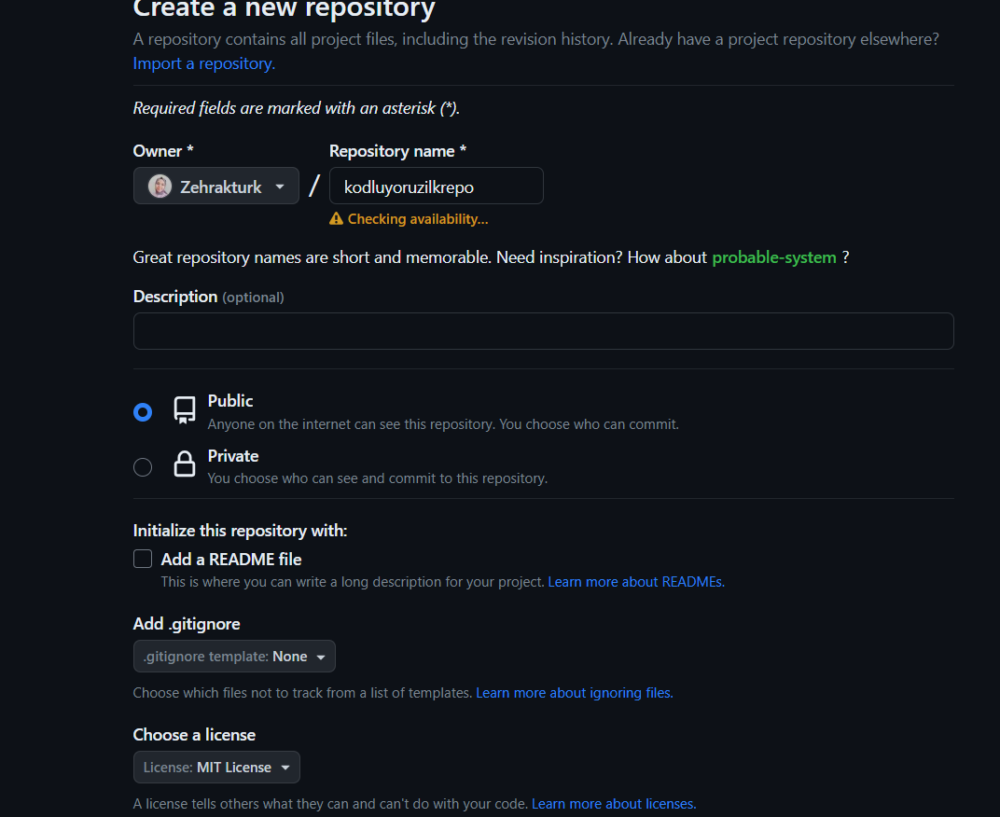

# Kodluyoruz İlk Repo
<p>Bu repo Kodluyoruz Front-End Eğitiminde oluşturduğumuz ilk repo. İçerisinde bir adet README dosyası, bir adet de index.html barındırıyor.</p>

# Installation

****
<p>Öncelikle projeyi clonelayın. (Buraya sizin reponuzdan aldığınız link gelecek)</p>

> git clone https://github.com/Zehrakturk/kodluyoruzilkrepo.git

#Usage
***
Projeyi cloneladıktan sonra Visual Studio Code programında açınız.
Linux için:
```Linux
cd kodluyoruzilkrepo
code .
```
# Contributing
***
Pull requestler kabul edilir. Büyük değişiklikler için, lütfen önce neyi değiştirmek istediğinizi tartışmak için bir konu açınız.
#Licanse
[MIT](https://choosealicense.com/licenses/mit/)

<a href="intex.html">Örnek web site</a>
